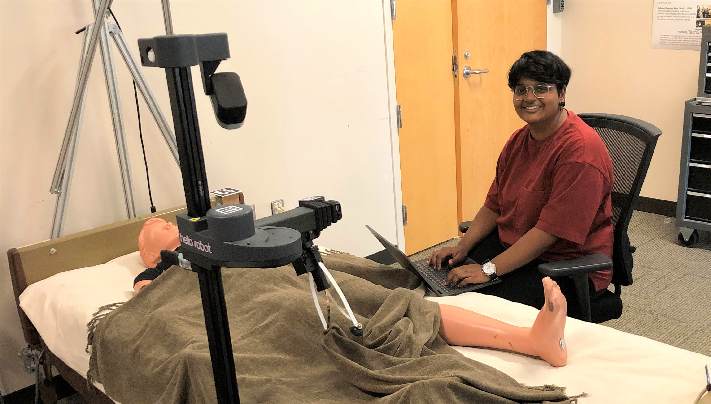

---
#
# By default, content added below the "---" mark will appear in the home page
# between the top bar and the list of recent posts.
# To change the home page layout, edit the _layouts/home.html file.
# See: https://jekyllrb.com/docs/themes/#overriding-theme-defaults
#
layout: page
---

   
  Hello! I am a fourth-year undergraduate student at Virginia Commonwealth University majoring in Biomedical Engineering. My general research interests include assistive and rehabilitation robotics, as well as human-robot interaction. This Fall, I am preparing to apply to PhD programs in Robotics for admission in Fall 2022.

## News

**10/11/21:** I am joining the [Robotic Caregiving and Human Interaction Lab (RCHI)](https://rchi-lab.github.io/), led by [Dr. Zackory Erickson](https://zackory.com/), at the Robotics Institute at Carnegie Mellon University! I will be working remotely to continue my previous research into robotic bedding manipulation around people.

**9/9/21:** I submitted my first-ever first author paper, based on my summer work as part of the SURE Robotics REU, for review! We submitted the paper for consideration in RA-L and, by extension, ICRA. The preprint version the paper is available at [ArXiv](https://arxiv.org/abs/2109.04930).

**Summer 2021:** I particated in the SURE Robotics REU at Georgia Tech this summer! I investigated autonomous robotic bedding manipulation around people under the guidance of [Dr. Zackory Erickson](https://zackory.com/) and [Dr. Charlie Kemp](https://charliekemp.com/). 
  
