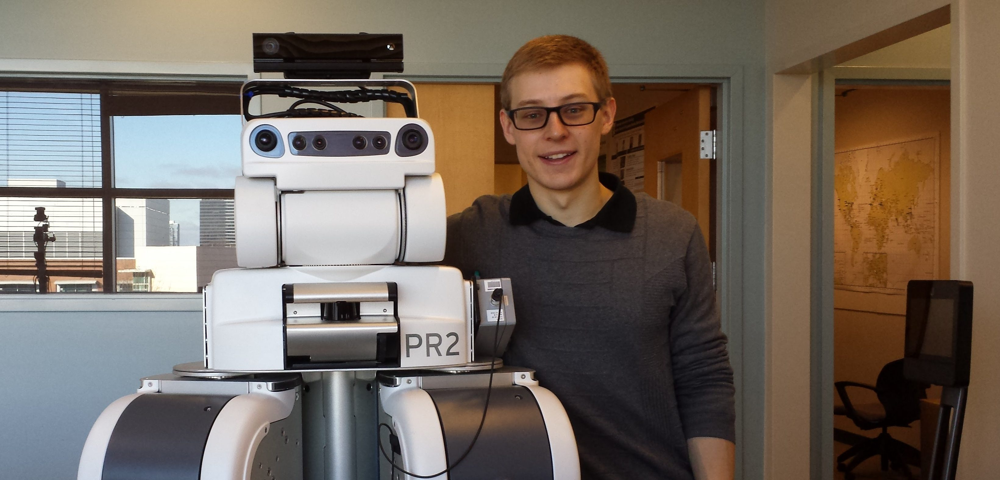

---
#
# By default, content added below the "---" mark will appear in the home page
# between the top bar and the list of recent posts.
# To change the home page layout, edit the _layouts/home.html file.
# See: https://jekyllrb.com/docs/themes/#overriding-theme-defaults
#
layout: page
---

  I am a tenure-track Assistant Professor in <a href="https://www.ri.cmu.edu">The Robotics Institute</a> at <a href="https://www.cmu.edu">Carnegie Mellon University</a>, where I lead the <a href="https://rchi-lab.github.io">Robotic Caregiving and Human Interaction (RCHI) Lab</a>.
  My research explores intelligent physical human-robot interaction, with applications in healthcare robotics.

  

  Previously, I received my PhD in Robotics at Georgia Tech advised by <a href="http://ckemp.bme.gatech.edu/">Charlie Kemp</a>.

  

  I am actively recruiting PhD and Master’s students for my research group.
  If you are a current or admitted student at CMU and interested in joining our group, please email me: <a href="mailto:zackory@cmu.edu">zackory@cmu.edu</a>

<h2>News</h2>
<ul>
  <li>Organizing an ICRA 2021 workshop <a href="https://sites.gatech.edu/learning-caregiving-icra2021/">Learning for Caregiving Robots</a></li>
</ul>

<h4>Extra links</h4>
You can find a recording of my Robotics PhD Defense at Georgia Tech here: <a href="https://youtu.be/3DYv8SlaP2w">https://youtu.be/3DYv8SlaP2w</a>

In 2016, I participated in the 4th Heidelberg Laureate Forum. Here are <a href="http://zackory.com/heidelberg-laureate-forum/">some photos from the 4th HLF</a>.
